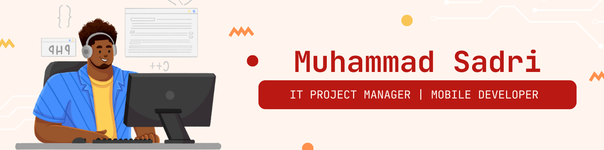

<!-- Banner -->

  

<h1 align="center">Hi there, I'm Muhammad Sadri! 👋</h1>
<h3 align="center">🚀 Mobile Developer | 🎯 IT Project Manager | 💡 Tech Enthusiast</h3>

## 🚀 About Me

🎓 **Education**: Informatics, Telkom University  
💼 **Profession**: Mobile Developer & IT Project Manager  
📍 **Location**: Indonesia  
💡 Passionate about building mobile applications and managing tech projects efficiently!

## 🔧 Tech Stack

- 🏗 **Mobile Development**: Flutter, Kotlin, Swift
- 🛠 **Backend**: Firebase, Node.js, Laravel
- 🗄 **Database**: MySQL, PostgreSQL, Firestore
- 🎨 **UI/UX**: Figma, Material Design
- 🚀 **Project Management**: Agile, Scrum, Trello, Jira

## 📊 GitHub Contributions

  

## 📫 Contact Me

📧 Email: your.email@example.com  
💼 LinkedIn: [linkedin.com/in/muhammad-sadri](https://linkedin.com/in/muhammad-sadri)  
🚀 GitHub: [github.com/muuri19](https://github.com/muuri19)

---

⭐️ _Feel free to connect with me and collaborate on exciting projects!_ 🚀
